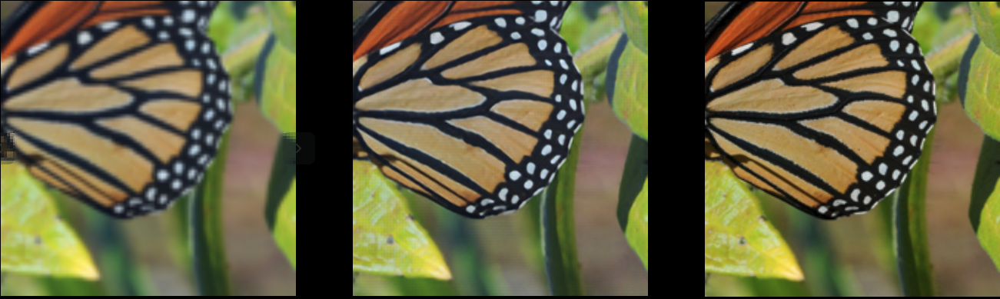

# SRDenseNet-PyTorch

### Overview

This repository contains an op-for-op PyTorch reimplementation
of [Image Super-Resolution Using Dense Skip Connections](https://openaccess.thecvf.com/content_ICCV_2017/papers/Tong_Image_Super-Resolution_Using_ICCV_2017_paper.pdf)
.

### Table of contents

- [SRDenseNet-PyTorch](#srdensenet-pytorch)
    - [Overview](#overview)
    - [Table of contents](#table-of-contents)
    - [About Image Super-Resolution Using Dense Skip Connections](#about-image-super-resolution-using-dense-skip-connections)
    - [Download weights](#download-weights)
    - [Download datasets](#download-datasets)
        - [Download train dataset](#download-train-dataset)
        - [Download valid dataset](#download-valid-dataset)
    - [Test](#test)
    - [Train](#train)
    - [Result](#result)
    - [Credit](#credit)
        - [Image Super-Resolution Using Dense Skip Connections](#image-super-resolution-using-dense-skip-connections)

## About Image Super-Resolution Using Dense Skip Connections

If you're new to SRDenseNet, here's an abstract straight from the paper:

Recent studies have shown that the performance of single-image super-resolution methods can be significantly boosted by using deep convolutional
neural networks. In this study, we present a novel single-image super-resolution method by introducing dense skip connections in a very deep network.
In the proposed network, the feature maps of each layer are propagated into all subsequent layers, providing an effective way to combine the low-level
features and high-level features to boost the reconstruction performance. In addition, the dense skip connections in the network enable short paths to
be built directly from the output to each layer, alleviating the vanishing-gradient problem of very deep networks. Moreover, deconvolution layers are
integrated into the network to learn the upsampling filters and to speedup the reconstruction process. Further, the proposed method substantially
reduces the number of parameters, enhancing the computational efficiency. We evaluate the proposed method using images from four benchmark datasets
and set a new state of the art.

## Download weights

- [Google Driver](https://drive.google.com/drive/folders/1044IuGd5EfoxNd4g1LVWsYTyEb0AzOkh?usp=sharing)
- [Baidu Driver](https://pan.baidu.com/s/1XmwVkY-1p14KscHJILYcMA) access:`llot`

## Download datasets

### Download train dataset

#### ImageNet

- Image format
    - [Google Driver](https://drive.google.com/drive/folders/1yqbT5gLUuOpemk0IvWNC08080GY7qwNI?usp=sharing)
    - [Baidu Driver](https://pan.baidu.com/s/18OBZKb-LnNz_a55rtWq1zg) access: `llot`

- LMDB format (train)
    - [Google Driver](https://drive.google.com/drive/folders/1BPqN08QHk_xFnMJWMS8grfh_vesVs8Jf?usp=sharing)
    - [Baidu Driver](https://pan.baidu.com/s/1eqeORnKcTmGatx2kAG92-A) access: `llot`

- LMDB format (valid)
    - [Google Driver](https://drive.google.com/drive/folders/1bYqqKk6NJ9wUfxTH2t_LbdMTB04OUicc?usp=sharing)
    - [Baidu Driver](https://pan.baidu.com/s/1W34MeEtLY0m-bOrnaveVmw) access: `llot`

### Download valid dataset

#### Set5

- Image format
    - [Google Driver](https://drive.google.com/file/d/1GtQuoEN78q3AIP8vkh-17X90thYp_FfU/view?usp=sharing)
    - [Baidu Driver](https://pan.baidu.com/s/1dlPcpwRPUBOnxlfW5--S5g) access:`llot`

#### Set14

- Image format
    - [Google Driver](https://drive.google.com/file/d/1CzwwAtLSW9sog3acXj8s7Hg3S7kr2HiZ/view?usp=sharing)
    - [Baidu Driver](https://pan.baidu.com/s/1KBS38UAjM7bJ_e6a54eHaA) access:`llot`

#### BSD100

- Image format
    - [Google Driver](https://drive.google.com/file/d/1xkjWJGZgwWjDZZFN6KWlNMvHXmRORvdG/view?usp=sharing)
    - [Baidu Driver](https://pan.baidu.com/s/1EBVulUpsQrDmZfqnm4jOZw) access:`llot`

#### BSD200

- Image format
    - [Google Driver](https://drive.google.com/file/d/1cdMYTPr77RdOgyAvJPMQqaJHWrD5ma5n/view?usp=sharing)
    - [Baidu Driver](https://pan.baidu.com/s/1xahPw4dNNc3XspMMOuw1Bw) access:`llot`

## Test

Modify the contents of the file as follows.

- line 24: `upscale_factor` change to the magnification you need to enlarge.
- line 25: `mode` change Set to valid mode.
- line 78: `model_path` change weight address after training.

## Train

Modify the contents of the file as follows.

- line 24: `upscale_factor` change to the magnification you need to enlarge.
- line 25: `mode` change Set to train mode.

If you want to load weights that you've trained before, modify the contents of the file as follows.

- line 48: `resume` change to `True`.
- line 49: `strict` Transfer learning is set to `False`, incremental learning is set to `True`.
- line 50: `start_epoch` change number of training iterations in the previous round.
- line 51: `resume_weight` the weight address that needs to be loaded.

## Result

Source of original paper results: https://openaccess.thecvf.com/content_ICCV_2017/papers/Tong_Image_Super-Resolution_Using_ICCV_2017_paper.pdf

In the following table, the value in `()` indicates the result of the project, and `-` indicates no test.

| Dataset | Scale |       PSNR       | 
|:-------:|:-----:|:----------------:|
|  Set5   |   4   | 32.02(**31.55**) |
|  Set14  |   4   | 28.50(**28.03**) |

Low Resolution / Super Resolution / High Resolution
<span align="center"></span>

### Credit

#### Image Super-Resolution Using Dense Skip Connections

_Tong, Tong and Li, Gen and Liu, Xiejie and Gao, Qinquan_ <br>

**Abstract** <br>
Recent studies have shown that the performance of single-image super-resolution methods can be significantly boosted by using deep convolutional
neural networks. In this study, we present a novel single-image super-resolution method by introducing dense skip connections in a very deep network.
In the proposed network, the feature maps of each layer are propagated into all subsequent layers, providing an effective way to combine the low-level
features and high-level features to boost the reconstruction performance. In addition, the dense skip connections in the network enable short paths to
be built directly from the output to each layer, alleviating the vanishing-gradient problem of very deep networks. Moreover, deconvolution layers are
integrated into the network to learn the upsampling filters and to speedup the reconstruction process. Further, the proposed method substantially
reduces the number of parameters, enhancing the computational efficiency. We evaluate the proposed method using images from four benchmark datasets
and set a new state of the art.

[[Paper]](https://openaccess.thecvf.com/content_ICCV_2017/papers/Tong_Image_Super-Resolution_Using_ICCV_2017_paper.pdf)

```
@inproceedings{tong2017image,
  title={Image super-resolution using dense skip connections},
  author={Tong, Tong and Li, Gen and Liu, Xiejie and Gao, Qinquan},
  booktitle={Proceedings of the IEEE international conference on computer vision},
  pages={4799--4807},
  year={2017}
}
```
